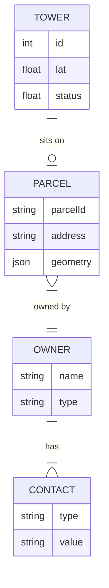

# System Entities Documentation

This document provides a comprehensive outline of the core data entities within the Tower Finder system. These entities represent the physical infrastructure, legal land properties, ownership details, and contact information used to drive the lead generation and research workflows.

## Entity Relationship Diagram (Conceptual)

---

## 1. Tower
**Description:**  
The `Tower` entity is the starting point of the workflow. It represents a physical point of interest—typically a telecommunications structure (monopole, lattice tower, etc.) or a specific coordinate location (`lat`/`lon`) identified as a potential lead.

**Key Characteristics:**
- **Primary Identifier:** Uniquely identified by `id`, but enforced unique by the combination of `lat` and `lon`.
- **Source:** Can be imported from external datasets (FCC, Excel) or manually added.
- **Role:** Acts as the "Lead" or "Asset" in the CRM process.

| Field | Type | Description |
| :--- | :--- | :--- |
| `id` | Int | Internal primary key. |
| `lat` / `lon` | Float | Geographic coordinates of the structure. |
| `type` | String? | Structure description (e.g., "Monopole", "Lattice"). |
| `status` | String | CRM Status (e.g., "New", "Researched", "Contacted"). Default: "Unknown". |
| `licensee` | String? | The entity operating the tower hardware (e.g., American Tower), NOT necessarily the land owner. |
| `source` | String | Origin of the data (e.g., "Excel Import", "Tower Finder"). |
| `parcel` | Relation | Link to the specific `Parcel` of land this tower sits on. |

---

## 2. Parcel
**Description:**  
The `Parcel` entity represents the legal plot of land (real estate) located at the Tower's coordinates. This data is typically retrieved from County Assessor APIs (e.g., ReportAll, Regrid) during the research phase.

**Key Characteristics:**
- **Bridge Entity:** Connects the physical `Tower` to the legal `Owner`.
- **Dynamic:** Contains rich data about the property boundaries and tax address.

| Field | Type | Description |
| :--- | :--- | :--- |
| `id` | Int | Internal primary key. |
| `parcelId` | String? | Official APN (Assessor's Parcel Number) from the county. |
| `address` | String? | Physical street address of the land. |
| `city` / `state` / `zip` | String? | Location details. |
| `geometry` | Json? | GeoJSON polygon data defining the property boundaries (used for map visualization). |
| `dataSource` | String? | The API provider used to fetch this record (e.g., "ReportAll"). |
| `rawData` | Json? | Full, unmodified JSON response from the external API for debugging/audit. |
| `towerId` | Int | Foreign key linking to the `Tower`. |
| `ownerId` | Int? | Foreign key linking to the `Owner`. |

---

## 3. Owner
**Description:**  
The `Owner` entity represents the legal entity or individual who holds the title to the `Parcel`. This is the target for outreach campaigns (direct mail, cold calling).

**Key Characteristics:**
- **Legal Owner:** Could be a private individual, an LLC, a Trust, or a Corporation.
- **One-to-Many:** One owner might own multiple parcels (though currently modeled simply, the schema allows for expansion).

| Field | Type | Description |
| :--- | :--- | :--- |
| `id` | Int | Internal primary key. |
| `name` | String | Legal name of the owner (e.g., "John Smith", "Acme Properties LLC"). |
| `type` | String? | Classification of the owner (e.g., "Individual", "LLC", "Trust"). |
| `address` | String? | **Mailing Address** of the owner (often different from the Parcel address). |
| `parcels` | Relation | List of land parcels owned by this entity. |
| `contacts` | Relation | List of discovered contact methods (skip-traced data). |

---

## 4. Contact
**Description:**  
The `Contact` entity represents specific communication channels found for an `Owner`. These are usually acquired through "Skip Tracing" (enrichment) processes.

**Key Characteristics:**
- **Actionable:** Used directly for dialing or emailing.
- **Validation:** Includes flags to track if a number is valid or disconnected.

| Field | Type | Description |
| :--- | :--- | :--- |
| `id` | Int | Internal primary key. |
| `type` | String | Channel type: "Phone" or "Email". |
| `value` | String | The actual number or email address (e.g., "+15550199"). |
| `label` | String? | Context for the contact (e.g., "Mobile", "Office", "Home"). |
| `isValid` | Boolean | Status flag. Default is `true`. |
| `ownerId` | Int | Foreign key linking to the `Owner`. |
