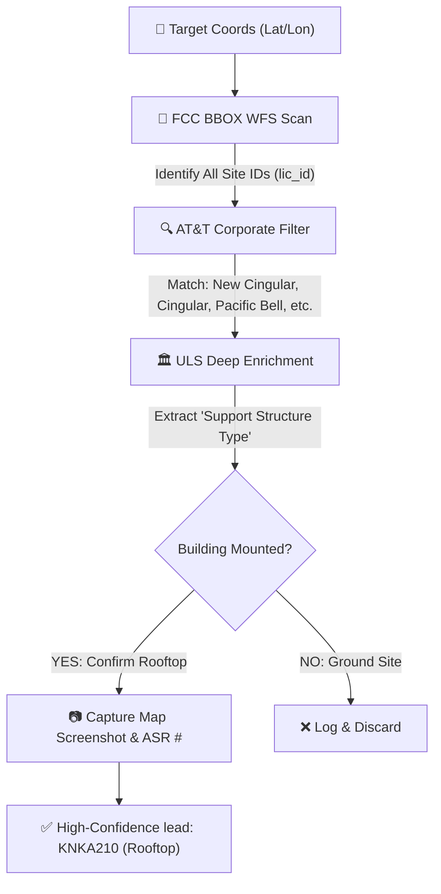

# 🏙️ FCC Rooftop Discovery Engine

The **AT&T Rooftop Discovery Engine** is a high-performance verification pipeline designed to identify and validate active AT&T rooftop leases by fusing FCC geospatial data with structural metadata.

## 🏗️ Discovery Architecture: Spatial-Visual Fusing

The system implements a multi-layered verification strategy to distinguish high-value rooftop leases from standard ground sites:

## 🚀 Key Technical Features

### 1. High-Speed Discovery (BBOX WFS)
We've pivoted from fragile HTML scraping to the **FCC's Geo-Service WFS API**. This transition provides several critical advantages:
- **Zero Form Friction**: Bypasses the complex, session-heavy geographic search forms.
- **WAF Survival**: BBOX queries are less likely to trigger Akamai bot detection than standard crawler patterns.
- **Structured Data**: Retrieves clean GeoJSON for all infrastructure in a specified radius (`radiusMiles`) using optimized bounding box logic.

### 2. Structural Verification (Building Detection)
The system performs deep-level parsing of individual license location detail pages to extract:
- **Support Structure Type**: Specifically filters for `B - Building` or `MTOWER - Monopole on Building`.
- **ASR # / File #**: Captures official regulatory registration data for high-confidence identification.

### 3. Visual Evidence Generation
For every site confirmed as a rooftop lease, the engine automatically:
- Navigates to the FCC's GIS Map tab.
- Captures a high-resolution map screenshot (`fcc_map_[CallSign].png`).
- Provides human-verifiable evidence for the final sales lead.

### 🛡️ Bot-Detection & Stability
The engine is powered by **Playwright-Extra** with `stealth` plugins to ensure it can navigate the FCC's highly-protected web interfaces. 

> [!IMPORTANT]
> The FCC's Geo-Service API can occasionally return 404s or timeouts. The implementation in `FCCService.ts` includes robust retry logic and defensive spatial filtering to maintain service continuity during production discovery tasks.

## 📂 Implementation References

- **Core Service**: [FCCService.ts](file:///c:/Users/alexa/Development/tower-finder/src/services/FCCService.ts)
- **Scoring Strategy**: [rooftop_verification.md](file:///c:/Users/alexa/Development/tower-finder/docs/rooftop_verification.md)
- **Test Harness**: [test_shadow.ts](file:///c:/Users/alexa/Development/tower-finder/src/conductor/test_shadow.ts)
