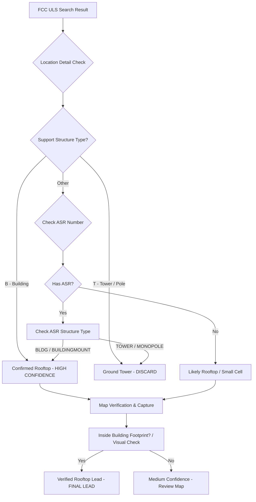

# Rooftop vs. Tower Verification Strategy

This document explains the multi-layer verification logic used to distinguish AT&T rooftop leases from ground-mounted towers.

## Overview

The core challenge is that a geographic radio license (ULS) does not explicitly state "rooftop" in the search results. We use a 3-layer confirmation strategy to filter out ground towers and focus on high-value rooftop opportunities.

## Verification Flow

## Layer 1: FCC ULS ASR Check
Most rooftop installations under 200 feet do not require **Antenna Structure Registration (ASR)**. 
- **Signal**: If an active AT&T license has **no ASR number** associated with its location, it is high probability a rooftop lease.
- **Process**: Navigate to the "Locations" tab of the license detail page.

## Layer 2: ASR Structure Type
If an ASR number exists, we query the FCC ASR database directly.
- **Standard Codes**:
    - `BLDG`: Building
    - `MTOWER`: Multi-tower building
    - `TOWER`: Standard Tower (Discard)
- **Signal**: Explicit `BLDG` code is a 100% confirmation.

## Layer 3: Geospatial building Footprint
Using the OpenStreetMap (Overpass API), we check if the antenna coordinates fall within a building polygon.
- **Buffer**: 30-meter radius check.
- **Signal**: Coordinates landing exactly on a building polygon confirms the physical attachment.

## Lead Scoring Model

| Layer | Condition | Confidence |
|-------|-----------|------------|
| FCC ULS | No ASR Number | Medium |
| FCC ASR | Type = BLDG | High |
| OSM | Inside Footprint | High |
| **Combined** | **All 3 Layer Matches** | **VERIFIED LEAD** |
